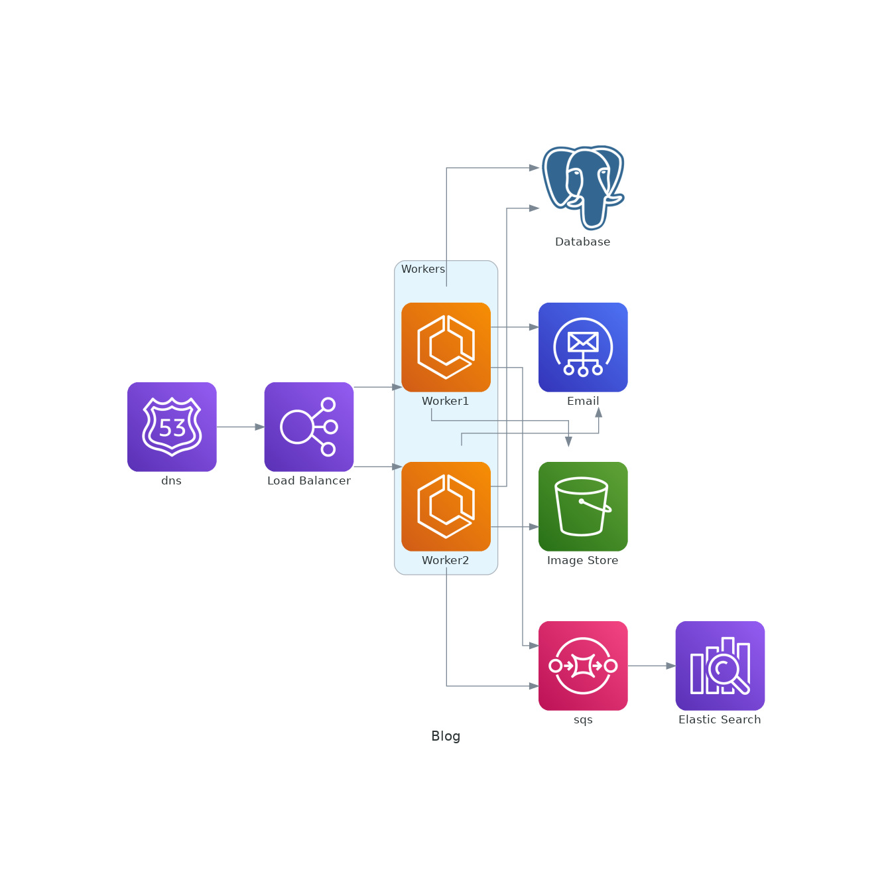
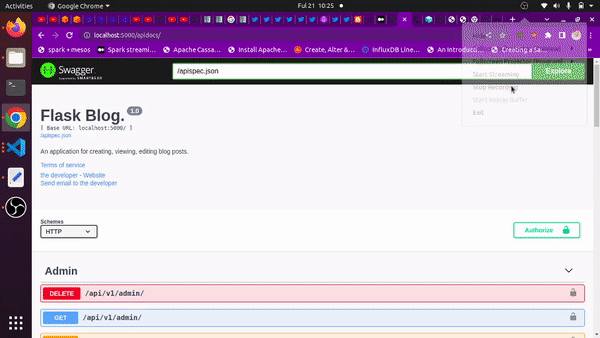

# blog-service - still under development

> A flask web app that enables a registered, authenticated and authorized user to create, view, edit and edit articles.

<p align="center">
  
  
  
  
  
  
  
  
  
  
  
  
  
  
  
  
</p>



## Project Overview
This is a web application that enables an author to register for an account, create, edit, view and delete blog posts. The applicatopn also provides for an admin, who can suspend offensive articles and authors, a moderator who can flag articles and authors as odffensive. The application provides a payment feature that only allows those whoe've payed to view articles. The application provides a custom content recommendation system as well as a content moderation system.

## Working

It's pretty easy to use the application. On the home page (http://localhost:5000/apidocs):

 1. Create an account (post details through register route)
 2. Send a confirmation email (post email address and author id theough the send_confirm_email route)
 3. Confirm email address (submit the author id and activation token from step 2)
 4. Log in using the login route (submit your email and password)
 5. Use the access token from step 4 to authorize yourself.
 6. Access other functionalities such as user update, viewing, deletion.


<!-- Click on the video below to [watch the application demo on YouTube](https://youtu.be/jl3b4eLKiP8): -->

<!-- <a href="http://www.youtube.com/watch?feature=player_embedded&v=jl3b4eLKiP8" target="_blank">
 
</a> -->

<p align=center>
  
</p>

 ## Features

This application has several features including:

1. Deployed to an AWS ECS using Codedeploy.
2. Versioned using git and Hosted on GitHub.
3. Auto-deployed to AWS using AWS CodePipeline.
4. Uses gunicorn as the application servers.
5. Uses an Application Load Balancer to redirect traffic to the frontend
6. Uses AWS Opensearch and Firehose for logging.
7. Uses AWS SES to send confirmation emails.
8. Uses JWT to authorize users.

## Local Setup

Here is how to set up the application locally:

  1. Clone the application repo:</br>

      ```sh
      git clone https://github.com/twyle/blog-service.git
      ```

  2. Navigate into the cloned repo:

      ```sh
      cd blog-service
      ```

  3. Create a Virtual environment:

      ```sh
      python3 -m venv venv
      ```

  4. Activate the virtual environmnet:

      ```sh
      source venv/bin/activate
      ```

  5. Install the project dependancies:

      ```sh
      pip install --upgrade pip # update the package manager
      pip install -r requirements.txt
      ```

  6. Create the environment variables for each service:

      ```sh
      touch .env
      ```

      Then paste the following into the file:

      ```sh

        FLASK_DEBUG=True
        FLASK_ENV=development
        FLASK_APP=manage.py

        SECRET_KEY=secret-key

        POSTGRES_HOST=localhost
        POSTGRES_USER=lyle
        POSTGRES_PASSWORD=lyle
        POSTGRES_DB=lyle
        POSTGRES_PORT=5432

        MAIL_USERNAME=<mail-user-name>
        MAIL_PASSWORD=<mail-password>
        MAIL_SERVER=<mail-server>
        MAIL_PORT=465
        MAIL_USE_SSL=True
        MAIL_DEFAULT_SENDER=<default-email>

        S3_BUCKET=<s3-bucket-name>
        AWS_ACCESS_KEY=<aws-access-key>
        AWS_ACCESS_SECRET=<aws-secret-key>

      ```

      Then create the database secrets:

      ```sh
      cd services/database
      touch .env
      ```

      Then paste the following into the file:

      ```sh
        POSTGRES_DB=lyle
        POSTGRES_PORT=5432
        POSTGRES_USER=postgres
        POSTGRES_PASSWORD=lyle
      ```

  7. Start the database containers:

      ```sh
      docker-compose -f database/docker-compose.yml up --build -d
      ```

  8. Create the database migrations:

      ```sh
      flask db migrate -m "Initial migration."
      flask db upgrade
      ```

  9. Start the services:

      ```sh
      python manage.py run
      ```

  10. View the running application

      Head over to http://0.0.0.0:5000/apidocs

 <!-- <p align=center>
  
</p> -->

## Development

 #### 1. Application Design

  1. **Services**

      The application consists of one service and a lambda function for uploading images to S3:

      1. User Management Service

      

        This service is resposible for the registration of new users, as well as the authentication and authorization of registered users. The routes include:

        | Route                   | Method  | Description                   |
        | ------------------------| ------- |----------------------------   |
        | 'api/v1/auth/register/admin'    | POST | Register a new admin.    |
        | 'api/v1/auth/register/author'   | POST | Register a new author.   |
        | 'api/v1/auth/register/moderator'| POST | Register a new moderator.|
        | 'api/v1/auth/reset_password'    | POST | Reset a password.        |
        | 'api/v1/auth/login'     | POST    | Login as a registered user. |
        | 'api/v1/auth/logout'    | POST    | Logout as a logged in user. |
        | 'api/v1/auth/confirm_email'| POST | Confirm email address.      |
        | 'api/v1/auth/refresh_token'| POST | Get a new access token.     |
        | 'api/v1/admin'           | DELETE  | Delete a admin.              |
        | 'api/v1/admin'           | PUT     | Update admin info.           |
        | 'api/v1/admin'           | GET     | Get a admin's info.          |
        | 'api/v1/admins'          | GET     | List all admins.             |
        | 'api/v1/moderator'  | DELETE  | Delete a moderator.              |
        | 'api/v1/moderator'  | PUT     | Update moderator info.           |
        | 'api/v1/moderator'  | GET     | Get a moderator's info.          |
        | 'api/v1/moderators' | GET     | List all moderators.             |
        | 'api/v1/author'           | DELETE  | Delete a author.              |
        | 'api/v1/author'           | PUT     | Update author info.           |
        | 'api/v1/author'           | GET     | Get a author's info.          |
        | 'api/v1/authors'          | GET     | List all authors.             |
        | 'api/v1/author/follow'    | POST    | Follow an author.              |
        | 'api/v1/email/send_confirm_email' | POST | Send account confirmation email. |
        | 'api/v1/email/send_password_reset_email' | POST | Send password reset email. |
        | 'api/v1/report/author' | POST | Report an offensive author.|
        | 'api/v1/report/article' | POST | Report an offensive article.|
        | 'api/v1/flag/author' | POST | Flag an offensive author.|
        | 'api/v1/flag/article' | POST | Flag an offensive article.|
        | 'api/v1/suspend/author' | POST | Suspend an offensive author.|
        | 'api/v1/suspend/article' | POST | Suspend an offensive article.|
        | 'api/v1/article'           | DELETE  | Delete a article.              |
        | 'api/v1/article'           | PUT     | Update article info.           |
        | 'api/v1/article'           | GET     | Get a article's info.          |
        | 'api/v1/article'           | POST    | Create an article.             |
        | 'api/v1/articles'          | GET     | List all articles.             |
        | 'api/v1/article/comment'   | POST    | Comment on an article.         |
        | 'api/v1/article/like'      | POST    | Like an article.               |

        1. Register as a new author with a unique email address and password as well as name.(Generates a uniques token)
        2. Proceed to your email address and click on the link given within 24 hours to activate your account. (marks account as activated)
        3. Log into your account using your email and password. (You get a unique token for authorization)

        This service uses the Postgres Database to store the user info. It use celery to process and upload images to AWS S3 and send emails using AWS SES.

  2. **Database**

      The application uses Postgres and AWS S3. The postgres database is used to store user details. The AWS S3 bucket is used to store the profile pictures.

  3. **Security**

      The application uses JSON Web Tokens to authorize access to protected routes. The passwords are also encrypted.

 #### 2. Project Management

   1. **Coding standards** </br>

      The application had to adhere to the following coding standards:
      1. Variable names
      2. Function names
      3. Test driven development
      4. Individual modules need 60% coverage and an overall coverage of 60%.
      5. CI/CD pipeline has to pass before deployments.
      6. Commit messages format has to be adhered to.
      7. Only push code to github using development branches.
      8. Releases have to be tagged.
      9. Use pre-commit to run code quality checks
      10. Use comitizen to format commit messages

   2. **Application development process management** </br>

      The project uses GitHub Projects for management.

 #### 3. Development Workflow

 The application uses atleast 5 branches:

  1. Features branch used to develop new features.
  2. Development branch used to hold the most upto date features that are yet to be deployed.
  3. Staging branch holds the code that is currently being tested for production.
  4. The release branch holds all the assets used when creating a release.
  5. The production branch holds the code for the currently deployed application.

The development workflow follows the following steps:

  1. A feature branch is created for the development of a new feature.
  2. The code is then pushed to GitHub, triggering the feature-development-workflow.yml workflow. If all the tests pass, the feature is reviewde and merged into the development branch.
  3. The code in the development branch is then deployed to the development environment. If the deployment is succesful, the development branch is merged into the staging branch.
  4. This triggers the staging workflow. If all the tests are succesful, this branch is reviewed and deployed to a staging environment.
  5. For creatinga release, the staging branch is merged into the release branch. This happens when a tag is pushed to GitHub.
  6. Once a release is created, the release branch is merged into the production branch, which is deployed into production.

The workflows require a couple of secrets to work:

      ```sh
        FLASK_APP=manage.py
        FLASK_ENV=development

        SECRET_KEY=supersecretkey

        POSTGRES_HOST=<YOUR-IP-ADDRESS>
        POSTGRES_DB=lyle
        POSTGRES_PORT=5432
        POSTGRES_USER=postgres
        POSTGRES_PASSWORD=lyle

      ```

The workflows also require the followingenvironments to work:

  1. Test
  2. Staging
  3. Development
  4. Production

And within each environment, create a secret that indicates the environment type i.e

  1. Test -> ```FLASK_ENV=test```
  2. Staging -> ```FLASK_ENV=stage```
  3. Development -> ```FLASK_ENV=development```
  4. Production -> ```FLASK_ENV=production```

  ## Contribution

1. Fork it https://github.com/twyle/repo-template/fork
2. Create your feature branch (`git checkout -b feature/fooBar`)
3. Commit your changes (`git commit -am 'Add some fooBar'`)
4. Push to the branch (`git push origin feature/fooBar`)
5. Create a new Pull Request

## Developer

Lyle Okoth – [@lylethedesigner](https://twitter.com/lylethedesigner) on twitter </br>

[lyle okoth](https://medium.com/@lyle-okoth) on medium </br>

My email is lyceokoth@gmail.com </br>

Here is my [GitHub Profile](https://github.com/twyle/)

You can also find me on [LinkedIN](https://www.linkedin.com/in/lyle-okoth/)

## License

Distributed under the MIT license. See ``LICENSE`` for more information.
